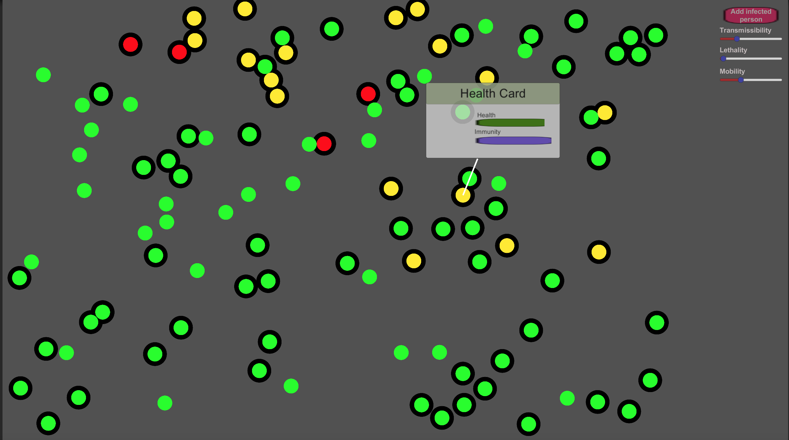

# UnityBallStrike - Visual simulation of virus spread in population.
A simulation program using unity framework and C# programing language. Program demonstrate spread of a virus when an infected body enter into the population. 
All probabilty calculations using normal distribution and exponential growth and deccay.

# What it demonstrate?
* Virus spread faster in dense population
* Immunity developed when someone get infected
* Spread is faster with higher mobility of population
* Immunity developed resistance to get infection but lost as time passes
* Spread is faster if virus transmissibility is higher
* Virus Lethality impact on health deterioration during infection and can also cause death on highly lethal virus.
# Coming soon
* Vaccination improves immunity
* Drill down on statistics of indivual and macro level time chart
